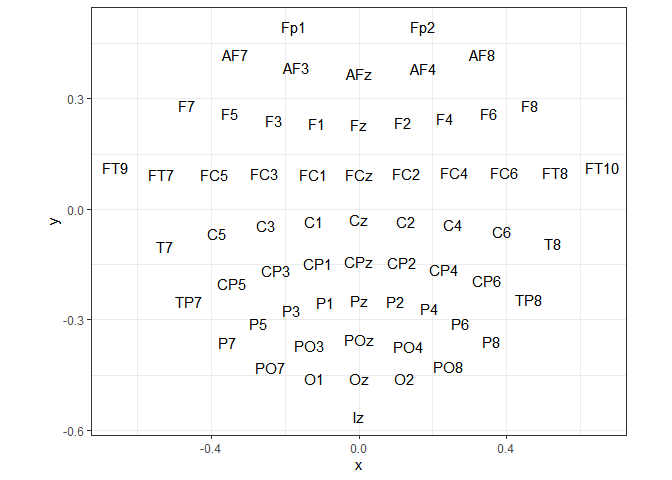
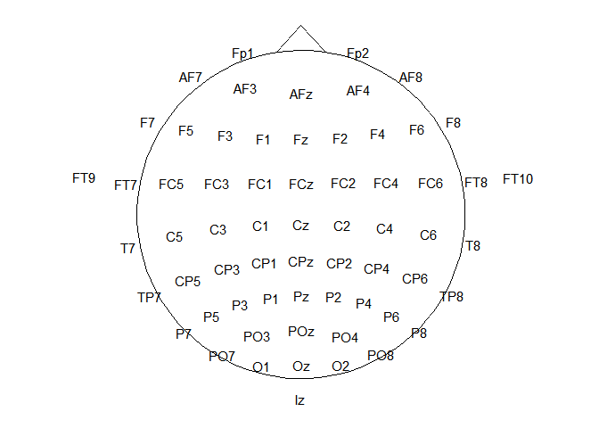
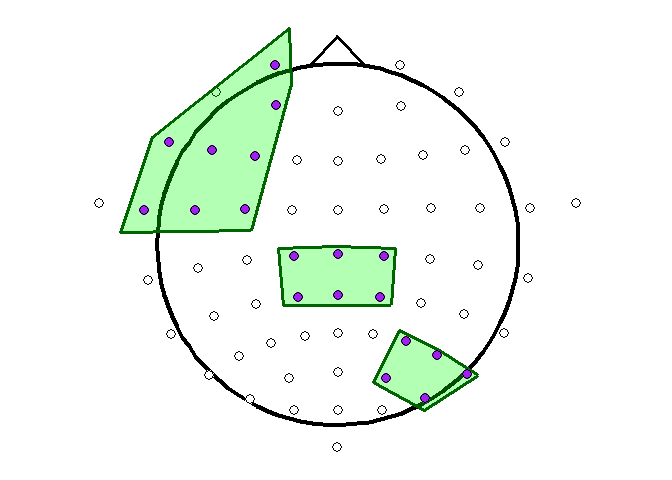
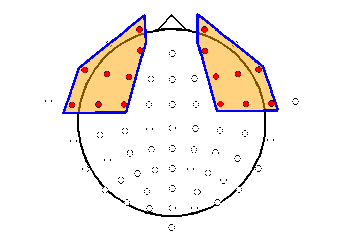

Visualizing Regions of Interest (ROIs) on a Scalp Map
================
Peter Lam
2025-12-02

``` r
library(ggplot2)
library(tidyverse)
```

# Introduction

## Who is this for?

This document is intended for researchers and data analysts working with
EEG data who wish to visualize Regions of Interest (ROIs) on a scalp
map. The provided R function allows users to highlight specific ROIs by
outlining them and marking the associated electrodes, facilitating
better interpretation of EEG data in relation to anatomical regions.

## Why use this?

Visualizing ROIs on a scalp map is crucial for understanding the spatial
distribution of EEG signals and their relation to brain activity.
Highlighting specific ROIs can help in identifying patterns, comparing
conditions, and communicating findings effectively. This function
simplifies the process of creating such visualizations, making it
accessible even for those with limited experience in R programming.

## Quick start

To quickly visualize ROIs on a scalp map, you can use the
`draw_roi_highlights` function provided in this document. First, ensure
you have the necessary electrode location data in a CSV file named
`chanLocs.csv`, obtained from the EEGLAB standard 10-20 system. Then,
copy the function definition from the [The `draw_roi_highlights`
Function (self contained
section)](https://github.com/lchpeterlam/Plotting-electrode-ROI-assignment?tab=readme-ov-file#the-draw_roi_highlights-function-self-contained-section)
into your R script or R Markdown document. Finally, call the function
with your desired ROIs to generate the scalp map visualization.

## Overview of this document

This document demonstrates how to visualize Regions of Interest (ROIs)
on a scalp map using R. Section 2 shows step by step how we set up the
function (from drawing the scalp to knowing which electrode goes where).
[Section 3 contains the self-contained
function](https://github.com/lchpeterlam/Plotting-electrode-ROI-assignment?tab=readme-ov-file#the-draw_roi_highlights-function-self-contained-section)
that you can copy and paste into your R script or R Markdown document.
This is followed by some examples of the function’s usage is shown.
Finally, Section 4 is a documentation of the function parameters.

It is important to note that some code for creating the head shape and
electrode locations is adopted from the `eegUtils` R package created by
Matt Craddock, which has important functions to preprocess and present
data, such as making topographical maps
(<https://www.mattcraddock.com/blog/2017/09/05/eegutils-an-r-package-for-eeg/>).
The current function takes some of the code for building a scalp map and
adds the ability to easily highlight and outline ROIs.

# Setup

## Loading and Preparing Electrode Location Data

First, we load the electrode location data from a CSV file and convert
the polar coordinates to Cartesian coordinates.

``` r
# Read channel locations
chanLocs <- read_csv('chanLocs.csv') %>%
  rename(electrode = labels)

# Convert theta values (polar format) to radians (Cartesian coordinates)
chanLocs$radianTheta <- pi / 180 * chanLocs$theta

chanLocs <- chanLocs %>%
  mutate(x = .$radius * sin(.$radianTheta),
         y = .$radius * cos(.$radianTheta)) %>%
  select(electrode, x, y)
```

Let’s visualize the electrode locations in Cartesian coordinates.

``` r
# See how it's like
cartesian <- ggplot(chanLocs,
                    aes(x, y, label = electrode)) +
  geom_text() +
  theme_bw() +
  coord_equal()
cartesian
```

<!-- -->

## Defining the Scalp Map Theme and Head Shape

We define a custom theme (theme_topo) for the scalp map and create the
head shape using a circle function.

``` r
# Define theme for topo maps
theme_topo <- function(base_size = 12) {
  theme_bw(base_size = base_size) %+replace%
    theme(
      rect = element_blank(),
      line = element_blank(),
      axis.text = element_blank(),
      axis.title = element_blank()
    )
}

# Make head shape
circleFun <- function(center = c(0, 0), diameter = 1, npoints = 100) {
  r <- diameter / 2
  tt <- seq(0, 2 * pi, length.out = npoints)
  xx <- center[1] + r * cos(tt)
  yy <- center[2] + r * sin(tt)
  return(data.frame(x = xx, y = yy))
}

headShape <- circleFun(c(0, 0), round(max(chanLocs$x)), npoints = 100) # 0
nose <- data.frame(x = c(-0.075, 0, .075), y = c(.495, .575, .495))
```

Now, let’s see the electrode locations on the head shape.

``` r
# See final product of channel locations on a head
ggplot(headShape, aes(x, y)) +
  geom_path() +
  geom_text(data = chanLocs,
            aes(x, y, label = electrode)) +
  geom_line(data = nose,
            aes(x, y, z = NULL)) +
  theme_topo() +
  coord_equal()
```

<!-- -->

## Defining Regions of Interest (ROIs)

We define the ROIs by mapping electrode labels to ROI names. You can
(and should) change this to your own assignment.

``` r
# Define roi mapping
roi_mapping <- list(
  "Left anterior" = c("AF3", "Fp1", "F7", "F5", "F3", "FT7", "FC5", "FC3"),
  "Left central" = c("T7", "C5", "C3", "TP7", "CP5", "CP3"),
  "Left posterior" = c("P7", "P5", "P3", "PO9", "PO7", "PO3"),
  "Medial anterior" = c("F1", "Fz", "F2", "FC1", "FCz", "FC2"),
  "Medial central" = c("C1", "Cz", "C2", "CP1", "CPz", "CP2"),
  "Medial posterior" = c("P1", "Pz", "P2", "O1", "POz", "O2"),
  "Right anterior" = c("AF4", "Fp2", "F4", "F6", "F8", "FC4", "FC6", "FT8"),
  "Right central" = c("C4", "C6", "T8", "CP4", "CP6", "TP8"),
  "Right posterior" = c("P4", "P6", "P8", "PO4", "PO8", "PO10")
)

# Reverse the mapping
electrode_to_roi <- unlist(lapply(names(roi_mapping), 
                                  function(x) setNames(rep(x, length(roi_mapping[[x]])),
                                                       roi_mapping[[x]])))
```

# The `draw_roi_highlights` Function (self contained section)

Copy the two code chunks below (Function set-up and Function Definition)
into your R script or R Markdown document to use the
`draw_roi_highlights` function.

## Function set-up (reusing some code above)

``` r
# Read channel locations
chanLocs <- read_csv('chanLocs.csv') %>%
  rename(electrode = labels)

# Convert theta values (polar format) to radians (Cartesian coordinates)
chanLocs$radianTheta <- pi / 180 * chanLocs$theta

chanLocs <- chanLocs %>%
  mutate(x = .$radius * sin(.$radianTheta),
         y = .$radius * cos(.$radianTheta)) %>%
  select(electrode, x, y)

# Define theme for topo maps
theme_topo <- function(base_size = 12) {
  theme_bw(base_size = base_size) %+replace%
    theme(
      rect = element_blank(),
      line = element_blank(),
      axis.text = element_blank(),
      axis.title = element_blank()
    )
}

# Make head shape
circleFun <- function(center = c(0, 0), diameter = 1, npoints = 100) {
  r <- diameter / 2
  tt <- seq(0, 2 * pi, length.out = npoints)
  xx <- center[1] + r * cos(tt)
  yy <- center[2] + r * sin(tt)
  return(data.frame(x = xx, y = yy))
}

headShape <- circleFun(c(0, 0), round(max(chanLocs$x)), npoints = 100) # 0
nose <- data.frame(x = c(-0.075, 0, .075), y = c(.495, .575, .495))

# Define roi mapping
roi_mapping <- list(
  "Left anterior" = c("AF3", "Fp1", "F7", "F5", "F3", "FT7", "FC5", "FC3"),
  "Left central" = c("T7", "C5", "C3", "TP7", "CP5", "CP3"),
  "Left posterior" = c("P7", "P5", "P3", "PO9", "PO7", "PO3"),
  "Medial anterior" = c("F1", "Fz", "F2", "FC1", "FCz", "FC2"),
  "Medial central" = c("C1", "Cz", "C2", "CP1", "CPz", "CP2"),
  "Medial posterior" = c("P1", "Pz", "P2", "O1", "POz", "O2"),
  "Right anterior" = c("AF4", "Fp2", "F4", "F6", "F8", "FC4", "FC6", "FT8"),
  "Right central" = c("C4", "C6", "T8", "CP4", "CP6", "TP8"),
  "Right posterior" = c("P4", "P6", "P8", "PO4", "PO8", "PO10")
)

# Reverse the mapping
electrode_to_roi <- unlist(lapply(names(roi_mapping), 
                                  function(x) setNames(rep(x, length(roi_mapping[[x]])),
                                                       roi_mapping[[x]])))
```

## Function Definition

``` r
# Function to draw ROI outlines and highlights
draw_roi_highlights <- function(selected_rois, headShape = NULL, chanLocs = NULL, nose = NULL,
                                roi_fill_color = "blue", roi_fill_alpha = 0.3,
                                roi_outline_color = "blue", roi_outline_linewidth = 1.25,
                                electrode_circle_color = "red", electrode_circle_size = 3,
                                scalp_linewidth = 1.5, nose_linewidth = 1.25, roi_expansion_x = 1.3, roi_expansion_y = 1.4) {

  if (is.null(headShape)) headShape <- get("headShape", envir = parent.frame())
  if (is.null(chanLocs)) chanLocs <- get("chanLocs", envir = parent.frame())
  if (is.null(nose)) nose <- get("nose", envir = parent.frame())
  
  roi_electrodes <- unlist(roi_mapping[selected_rois])
  
  roi_data <- chanLocs %>%
    filter(electrode %in% roi_electrodes)
  
  # Calculate convex hull for each ROI with slight expansion
  roi_hulls <- lapply(selected_rois, function(roi) {
    electrodes <- roi_mapping[[roi]]
    roi_points <- chanLocs %>% filter(electrode %in% electrodes)
    if (nrow(roi_points) >= 3) {
      hull_indices <- chull(roi_points$x, roi_points$y)
      hull_points <- roi_points[c(hull_indices, hull_indices[1]), ] # Close the polygon
      
      # Expand the hull slightly
      center_x <- mean(hull_points$x)
      center_y <- mean(hull_points$y)
      expanded_hull <- hull_points %>%
        mutate(
          x = center_x + (x - center_x) * roi_expansion_x,
          y = center_y + (y - center_y) * roi_expansion_y
        )
      
      return(expanded_hull)
    } else {
      NULL
    }
  })
  
  names(roi_hulls) <- selected_rois
  
  p <- ggplot(headShape, aes(x, y)) +
    geom_path(linewidth = scalp_linewidth) +
    geom_line(data = nose, aes(x, y, z = NULL), linewidth = nose_linewidth) +
    theme_topo() +
    coord_equal() +
    geom_point(data = chanLocs, aes(x, y), shape = 21, size = electrode_circle_size, stroke = 1, fill = "white")
  
  # Add highlights and outlines
  for (roi in selected_rois) {
    if (!is.null(roi_hulls[[roi]])) {
      p <- p +
        geom_polygon(data = roi_hulls[[roi]], aes(x, y), fill = roi_fill_color, alpha = roi_fill_alpha) +
        geom_path(data = roi_hulls[[roi]], aes(x, y), color = roi_outline_color, linewidth = roi_outline_linewidth)
    }
  }

  # Add colored circles for selected ROI electrodes
  for (roi in selected_rois) {
    roi_electrodes_temp <- roi_mapping[[roi]]
    roi_chanlocs_temp <- chanLocs %>% filter(electrode %in% roi_electrodes_temp)
    p <- p + geom_point(data = roi_chanlocs_temp, aes(x,y), shape = 21, size = electrode_circle_size, stroke = 1, fill = electrode_circle_color)
  }

  return(p)
}
```

## Example Usage

Let’s use the `draw_roi_highlights` function to visualize different ROI
combinations.

Example 1: All ROIs

``` r
selected_rois <- c("Medial anterior", "Left anterior", "Right anterior", "Left central", "Medial central", "Right central", "Left posterior", "Medial posterior", "Right posterior")
roi_plot <- draw_roi_highlights(selected_rois)
roi_plot
```

<!-- -->

Example 2: Selected ROIs

``` r
selected_rois <- c("Left anterior", "Medial central", "Right posterior")
roi_plot <- draw_roi_highlights(selected_rois, roi_fill_color = "green", roi_outline_color = "darkgreen", electrode_circle_color = "purple")
roi_plot
```

<!-- -->

Example 3: Changing Parameters

``` r
selected_rois <- c("Left anterior", "Right anterior")
roi_plot <- draw_roi_highlights(selected_rois, roi_fill_color = "orange", roi_fill_alpha = 0.5, roi_outline_linewidth = 2, electrode_circle_size = 4, roi_expansion_x = 1.2, roi_expansion_y = 1.3)
roi_plot
```

<!-- -->

# Function Parameters Documentation

The `draw_roi_highlights` function provides several parameters to
customize the appearance of the scalp map. Below is a detailed
description of each parameter:

## Key Parameters

- **`selected_rois`**:
  - A character vector specifying the ROIs to be highlighted.
  - **Required**.
  - Options: Any combination of ROI names defined in the `roi_mapping`
    list (e.g., `c("Left anterior", "Medial central")`).

## Optional Parameters

- **`headShape`**:
  - A data frame defining the shape of the head.
  - Default: `NULL` (uses the `headShape` object from the calling
    environment).
  - Options: A data frame with `x` and `y` columns.
- **`chanLocs`**:
  - A data frame containing the electrode locations.
  - Default: `NULL` (uses the `chanLocs` object from the calling
    environment).
  - Options: A data frame with `electrode`, `x`, and `y` columns.
- **`nose`**:
  - A data frame defining the shape of the nose.
  - Default: `NULL` (uses the `nose` object from the calling
    environment).
  - Options: A data frame with `x` and `y` columns.
- **`roi_fill_color`**:
  - The fill color for the highlighted ROI areas.
  - Default: `"blue"`.
  - Options: Any valid R color (e.g., `"red"`, `"green"`, `"#FF0000"`).
- **`roi_fill_alpha`**:
  - The transparency (alpha) value for the ROI fill.
  - Default: `0.3`.
  - Options: A numeric value between 0 (fully transparent) and 1 (fully
    opaque).
- **`roi_outline_color`**:
  - The outline color for the highlighted ROI areas.
  - Default: `"blue"`.
  - Options: Any valid R color.
- **`roi_outline_linewidth`**:
  - The line width of the ROI outlines.
  - Default: `1.25`.
  - Options: A numeric value.
- **`electrode_circle_color`**:
  - The fill color for the electrode circles when they belong to a
    selected ROI.
  - Default: `"red"`.
  - Options: Any valid R color.
- **`electrode_circle_size`**:
  - The size of the electrode circles.
  - Default: `3`.
  - Options: A numeric value.
- **`scalp_linewidth`**:
  - The line width of the scalp outline.
  - Default: 1.5
  - Options: A numeric value.
- **`nose_linewidth`**:
  - The line width of the nose line.
  - Default: 1.25
  - Options: A numeric value.
- **`roi_expansion_x`**:
  - The expansion factor on the x axis for the ROI outlines.
  - Default: 1.3
  - Options: a numeric value. larger values push the outlines further
    from the center of the ROI.
- **`roi_expansion_y`**:
  - The expansion factor on the y axis for the ROI outlines.
  - Default: 1.4
  - Options: a numeric value. larger values push the outlines further
    from the center of the ROI.
